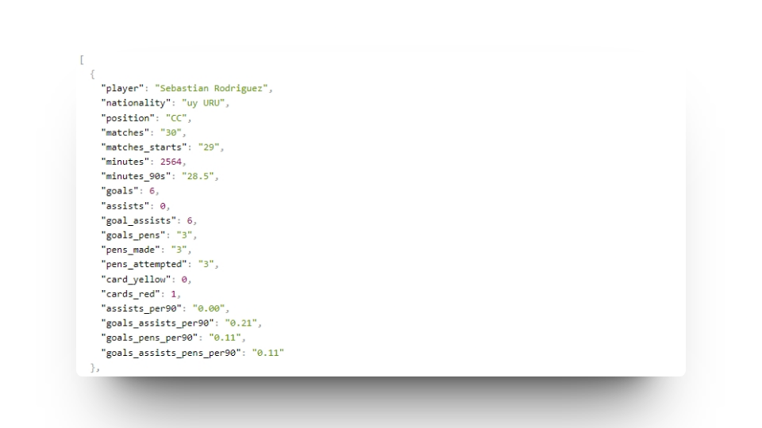

# Football Players Statistics API
This is an API that provides football players statistics by team and season. It utilizes web scraping techniques to gather data from a website and presents it in JSON format through an Express.js-based API.

Explore the API [here](https://football-stats-express-api-rq26.vercel.app).

## API Endpoints

### Get Players Statistics

- **Route**: `/players/:team/:year`
- **Method**: GET
- **Description**: This route allows you to get player statistics for a specific team in a particular season.
- **Parameters**:
  - `:team` (string): The name of the team (e.g., "Penarol").
  - `:year` (string): The year of the season (e.g., "2023").
- **Successful Response**: The API will respond with a JSON array containing player statistics.
- **Error Response**: In case of an error, the API will respond with a 500 status code and an error message in JSON.

## Example Usage

To retrieve player statistics for the "Penarol" team in the year "2023," make a GET request to the following URL:

https://football-stats-express-api-rq26.vercel.app/players/Penarol/2023

The API will respond with a JSON array containing player statistics for that team in the specified season.

## Configuration

You can customize the application's configuration by editing the `index.js` file. You can change the port on which the application runs and add more teams if necessary.

## Web Visualization and File Downloads

You can easily visualize and explore the player statistics on our website. Perform web searches for specific teams and seasons, and view the results right in your browser. Additionally, you have the option to download JSON data files for your own use.

Visit [Our Football Stats Website](https://web-scrapper-football-stats-nodejs.vercel.app/) to search, view, and download the data.
